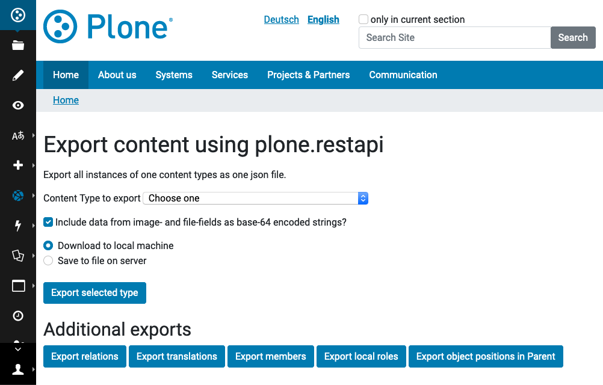
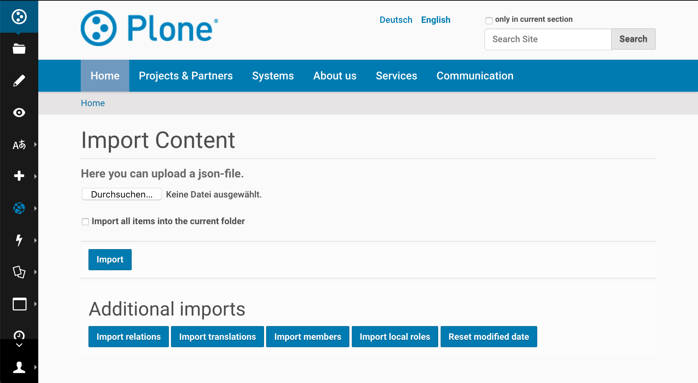

.. This README is meant for consumption by humans and pypi. Pypi can render rst files so please do not use Sphinx features.
   If you want to learn more about writing documentation, please check out: http://docs.plone.org/about/documentation_styleguide.html
   This text does not appear on pypi or github. It is a comment.

.. image:: https://img.shields.io/pypi/v/collective.exportimport.svg
    :target: https://pypi.python.org/pypi/collective.exportimport/
    :alt: Latest Version

.. image:: https://img.shields.io/pypi/status/collective.exportimport.svg
    :target: https://pypi.python.org/pypi/collective.exportimport
    :alt: Egg Status

.. image:: https://img.shields.io/pypi/pyversions/collective.exportimport.svg?style=plastic   :alt: Supported - Python Versions

.. image:: https://img.shields.io/pypi/l/collective.exportimport.svg
    :target: https://pypi.python.org/pypi/collective.exportimport/
    :alt: License

=======================
collective.exportimport
=======================

Export and import content, members, relations, translations and localroles

Features
========

* Export & Import content
* Export & Import members and groups with their roles
* Export & Import relations
* Export & Import translations
* Export & Import local roles
* Export & Import order (position in parent)
* Export & Import discussions/comments

Export supports:

* Plone 4, 5 and 6
* Archetypes and Dexterity
* Python 2 and 3
* plone.app.multilingual, Products.LinguaPlone, raptus.multilanguagefields

Import supports:

* Plone 5.2+, Dexterity, Python 2 and 3, plone.app.multilingual

Usage
=====

Export
------

Use the form with the URL ``/@@export_content``, and select what you want to export:

You can export one or more types and a whole site or only a specific path in a site. Since items are exported ordered by path importing them will create the same structure as you had originally.

The downloaded json-file will have the name of the path you exported from, e.g. ``Plone.json``.

The exports for members, relations, localroles and relations are linked to in this form but can also be called individually: ``/@@export_members``, ``/@@export_relations``, ``/@@export_localroles``, ``/@@export_translations``, ``/@@export_ordering``, ``/@@export_discussion``.

Import
------

Use the form with the URL ``/@@import_content``, and upload a json-file that you want to import:

The imports for members, relations, localroles and relations are linked to in this form but can also be called individually: ``/@@import_members``, ``/@@import_relations``, ``/@@import_localroles``, ``/@@import_translations``, ``/@@import_ordering``, ``/@@import_discussion``.

As a last step in a migration there is another view ``@@reset_modified_date`` that resets the modified date on imported content to the date initially contained in the imported json-file. This is necessary since varous changes during a migration will likely result in a updated modified-date. During import the original is stored as ``obj.modification_date_migrated`` on each new object and this view sets this date.

Use-cases
=========

Migrations
----------

When a in-place-migration is not required you can choose this addon to migrate the most important parts of your site to json and then import it into a new Plone instance of your targeted version:

* Export content from a Plone site (it supports Plone 4 and 5, Archetypes and Dexterity, Python 2 and 3).
* Import the exported content into a new site (Plone 5.2+, Dexterity, Python 3)
* Export and import relations, translations, users, groups and local roles.

It does not support any of the following data from your database:

* content revisions
* registry-settings
* portlets
* theme
* installed addons

Other
-----

You can use this addon to

* Archive your content as json
* Export data to prepare a migration to another system
* Combine content from mutiple plone-sites into one.
* Import a plone-site as a subsite into another.
* Import content from other systems as long as it fits the required format.
* Update or replace existing data
* ...

Details
=======

Export content
--------------

Exporting content is basically a wrapper for the serializers of plone.restapi:

.. code-block:: python

    from plone.restapi.interfaces import ISerializeToJson
    from zope.component import getMultiAdapter

    serializer = getMultiAdapter((obj, request), ISerializeToJson)
    data = serializer(include_items=False)

Import content
--------------

Importing content is a elaborate wrapper for the deserializers of plone.restapi:

.. code-block:: python

    from plone.restapi.interfaces import IDeserializeFromJson
    from zope.component import getMultiAdapter

    container.invokeFactory(item['@type'], item['id'])
    deserializer = getMultiAdapter((new, self.request), IDeserializeFromJson)
    new = deserializer(validate_all=False, data=item)

Use for migrations
------------------

A main use-case of this package is migration from one Plone-Version to another.

Exporting Archetypes content and importing that as Dexterity content works fine but due to changes in field-names some settings would get lost. For example the setting to exclude content from the navigation was renamed from ``excludeFromNav`` to ``exclude_from_nav``.

To fix this you can check the checkbox "Modify exported data for migrations". This will modify the data during export:

* Drop unused data (e.g. `next_item` and `components`)
* Remove all relationfields
* Change some fieldnames that changed between AT and DX

  * ``excludeFromNav`` → ``exclude_from_nav``
  * ``allowDiscussion`` → ``allow_discussion``
  * ``subject`` → ``subjects``
  * ``expirationDate`` → ``expires``
  * ``effectiveDate`` → ``effective``
  * ``creation_date`` → ``created``
  * ``modification_date`` → ``modified``
  * ``startDate`` → ``start``
  * ``endDate`` → ``end``
  * ``openEnd`` → ``open_end``
  * ``wholeDay`` → ``whole_day``
  * ``contactEmail`` → ``contact_email``
  * ``contactName`` → ``contact_name``
  * ``contactPhone`` → ``contact_phone``

* Update view names on Folders and Collection
* Export ATTopic and their criteria to Collections with querystrings
* Update Collection-criteria (TODO)
* Fix image links and scales (TODO)

Control creating imported content
---------------------------------

You can choose between four options how to deal with content that already exists:

  * Skip: Don't import at all
  * Replace: Delete item and create new
  * Update: Reuse and only overwrite imported data
  * Ignore: Create with a new id

Imported content is initially created with ``invokeFactory`` using portal_type and id of the exported item before deserialing the rest of the data.
You can set additional values by specifying a dict ``factory_kwargs`` that will be passed to the facory.
Like this you can set values on the imported object that are expected to be there by subscribers to IObjectAddedEvent.

Notes on speed and large migrations
===================================

Exporting and importing large amounts of content can take a while. Export is pretty fast but import is constrained by some features of Plone, most importantly versioning:

* Importing 5000 Folders takes ~5 minutes
* Importing 5000 Documents takes >25 minutes because of versioning.
* Importing 5000 Documents without versioning takes ~7 minutes.

During import you can commit every x number of items which will free up memory and disk-space in your TMPDIR (where blobs are added before each commit).

When exporting large numbers of blobs (binary files and images) you will get huge json-files and may run out of memory.
You have various options to deal with this.
The best way depends on how you are going to import the blobs:

- Export as download urls: small download, but ``collective.exportimport`` cannot import the blobs, so you will need an own import script to download them.
- Export as base-64 encoded strings: large download, but ``collective.exportimport`` can handle the import.
- Export as blob paths: small download and ``collective.exportimport`` can handle the import, but you need to copy ``var/blobstorage`` to the Plone Site where you do the import.

Customize export and import
===========================

This addon is designed to be adapted to your requirements and has multiple hooks to make that easy.

Export Example
--------------

.. code-block:: python

    from collective.exportimport.export_content import ExportContent

    class CustomExportContent(ExportContent):

        QUERY = {
            'Document': {'review_state': ['published', 'pending']},
        }

        DROP_PATHS = [
            '/Plone/userportal',
            '/Plone/en/obsolete_content',
        ]

        DROP_UIDS = [
            '71e3e0a6f06942fea36536fbed0f6c42',
        ]

        def update(self):
            """Use this to override stuff befor ethe export starts
            (e.g. force a specific language in the request)."""
            return

        def global_obj_hook(self, obj):
            """Inspect the content item before serialisation data.
            Bad: Changing the content-item is a horrible idea.
            Good: Return None if you want to skip this particular object.
            """
            return obj

        def global_dict_hook(self, item, obj):
            """Use this to modify or skip the serialized data.
            Return None if you want to skip this particular object.
            """
            return item

        def dict_hook_document(self, item, obj):
            """Use this to modify or skip the serialized data by type.
            Return the modified dict (item) or None if you want to skip this particular object.
            """
            return item

Register it with your own browserlayer to override the default:

.. code-block:: xml

  <browser:page
      name="export_content"
      for="zope.interface.Interface"
      class=".custom_export.CustomExportContent"
      layer="My.Custom.IBrowserlayer"
      permission="cmf.ManagePortal"
      />

Import Example
--------------

.. code-block:: python

    from collective.exportimport.import_content import ImportContent

    class CustomImportContent(ImportContent):

        CONTAINER = {'Event': '/imported-events'}

        # These fields will be ignored
        DROP_FIELDS = ['relatedItems']

        # Items with these uid will be ignored
        DROP_UIDS = ['04d1477583c74552a7fcd81a9085c620']

        # These paths will be ignored
        DROP_PATHS = ['/Plone/doormat/', '/Plone/import_files/']

        # Default values for some fields
        DEFAULTS = {'which_price': 'normal'}

        def start(self):
            """Hook to do something before importing one file."""

        def finish(self):
            """Hook to do something after importing one file."""

        def global_dict_hook(self, item):
            if isinstance(item.get('description', None), dict):
                item['description'] = item['description']['data']
            if isinstance(item.get('rights', None), dict):
                item['rights'] = item['rights']['data']
            return item

        def dict_hook_customtype(self, item):
            # change the type
            item['@type'] = 'anothertype'
            # drop a field
            item.pop('experiences', None)
            return item

        def handle_file_container(self, item):
            """Use this to specify the container in which to create the item in.
            Return the container for this particular object.
            """
            return return self.portal['imported_files']

Register it:

.. code-block:: xml

  <browser:page
      name="import_content"
      for="zope.interface.Interface"
      class=".custom_import.CustomImportContent"
      layer="My.Custom.IBrowserlayer"
      permission="cmf.ManagePortal"
      />

Use in code
-----------

It is possible to import data in a setuphandler or upgrade-step:

.. code-block:: python

    from pathlib import Path
    from plone import api

    def full_import():
        portal = api.portal.get()
        request = aq_get(portal, 'REQUEST')

        import_content = api.content.get_view('import_content', portal, request)
        path = Path(os.path.dirname(__file__)) / 'mydata.json'
        import_content(jsonfile=path.read_text(), return_json=True)

        import_translations = api.content.get_view('import_translations', portal, request)
        path = Path(os.path.dirname(__file__)) / 'translations.json'
        import_translations(jsonfile=path.read_text())

        import_relations = api.content.get_view('import_relations', portal, request)
        path = Path(os.path.dirname(__file__)) / 'relations.json'
        import_relations(jsonfile=path.read_text())

        import_members = api.content.get_view('import_members', portal, request)
        path = Path(os.path.dirname(__file__)) / 'members.json'
        import_members(jsonfile=path.read_text())

        import_ordering = api.content.get_view('import_ordering', portal, request)
        path = Path(os.path.dirname(__file__)) / 'ordering.json'
        import_ordering(jsonfile=path.read_text())

        import_defaultpages = api.content.get_view('import_defaultpages', portal, request)
        path = Path(os.path.dirname(__file__)) / 'defaultpages.json'
        import_defaultpages(jsonfile=path.read_text())

        reset_modified = api.content.get_view('reset_modified_date', portal, request)
        reset_modified()

Save all content to ``var/instance/``:

.. code-block:: python

    from plone import api
    from Products.Five import BrowserView

    class ExportAll(BrowserView):

        def __call__(self):
            export_content = api.content.get_view('export_content', self.context, self.request)
            self.request.form['form.submitted'] = True
            export_content(portal_type=['Folder', 'Document', 'Event'], include_blobs=2, download_to_server=True)
            # Important! Redirect to prevent infinite export loop :)
            return self.request.response.redirect(self.context.absolute_url())

Import all content from ``var/instance/import/``:

.. code-block:: python

    from App.config import getConfiguration
    from pathlib import Path
    from plone import api
    from plone.protect.interfaces import IDisableCSRFProtection
    from Products.Five import BrowserView
    from zope.interface import alsoProvides

    import os

    class ImportAll(BrowserView):

        def __call__(self):
            alsoProvides(self.request, IDisableCSRFProtection)
            instance_path = getConfiguration().clienthome
            import_content = api.content.get_view('import_content', self.context, self.request)
            self.request.form['form.submitted'] = True
            path = Path(instance_path) / 'import/my_data.json'
            import_content(jsonfile=path.read_text(), return_json=True)

Written by
----------

Installation
------------

Install collective.exportimport by adding it to your buildout::

    [buildout]

    ...

    eggs =
        collective.exportimport

and then running ``bin/buildout``

You don't need to activate the add-on in the Site Setup Add-ons control panel to be able to use the forms @@export_content and @@import_content in your site.

You do need to add it to your buildout configuration and run buildout to make these features available at all. See https://docs.plone.org/manage/installing/installing_addons.html for details.

Contribute
----------

- Issue Tracker: https://github.com/collective/collective.exportimport/issues
- Source Code: https://github.com/collective/collective.exportimport

Support
-------

If you are having issues, please let us know.

License
-------

The project is licensed under the GPLv2.
