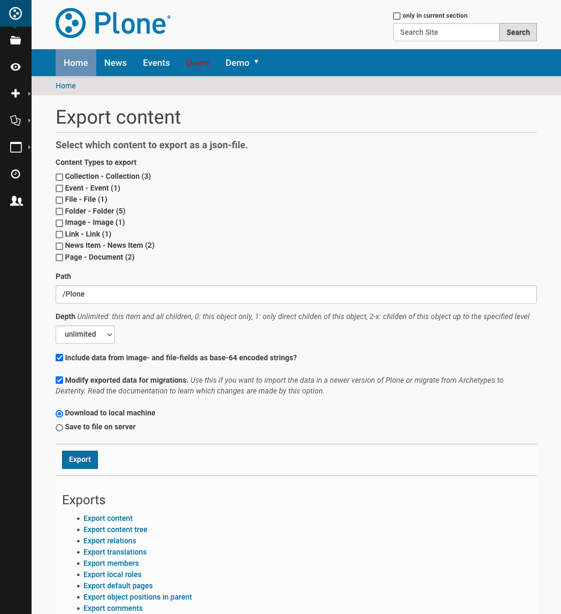

.. This README is meant for consumption by humans and pypi. Pypi can render rst files so please do not use Sphinx features.
   If you want to learn more about writing documentation, please check out: http://docs.plone.org/about/documentation_styleguide.html
   This text does not appear on pypi or github. It is a comment.

.. image:: https://img.shields.io/pypi/v/collective.exportimport.svg
    :target: https://pypi.python.org/pypi/collective.exportimport/
    :alt: Latest Version

.. image:: https://img.shields.io/pypi/status/collective.exportimport.svg
    :target: https://pypi.python.org/pypi/collective.exportimport
    :alt: Egg Status

.. image:: https://img.shields.io/pypi/pyversions/collective.exportimport.svg?style=plastic   :alt: Supported - Python Versions

.. image:: https://img.shields.io/pypi/l/collective.exportimport.svg
    :target: https://pypi.python.org/pypi/collective.exportimport/
    :alt: License

=======================
collective.exportimport
=======================

Export and import content, members, relations, translations, localroles and much more.

Export and import all kinds of data from and to Plone sites using a intermediate json-format.
The main use-case is migrations since it enables you to for example migrate from Plone 4 with Archetypes and Python 2 to Plone 6 with Dexterity and Python 3 in one step.
Most features use `plone.restapi` to serialize and deserialize data.

.. contents:: Contents
    :local:

Features
========

* Export & Import content
* Export & Import members and groups with their roles
* Export & Import relations
* Export & Import translations
* Export & Import local roles
* Export & Import order (position in parent)
* Export & Import discussions/comments
* Export & Import versioned content
* Export & Import redirects

Export supports:

* Plone 4, 5 and 6
* Archetypes and Dexterity
* Python 2 and 3
* plone.app.multilingual, Products.LinguaPlone, raptus.multilanguagefields

Import supports:

* Plone 5.2+, Dexterity, Python 2 and 3, plone.app.multilingual

Usage
=====

Export
------

Use the form with the URL ``/@@export_content``, and select what you want to export:

You can export one or more types and a whole site or only a specific path in a site. Since items are exported ordered by path importing them will create the same structure as you had originally.

The downloaded json-file will have the name of the path you exported from, e.g. ``Plone.json``.

The exports for members, relations, localroles and relations are linked to in this form but can also be called individually: ``/@@export_members``, ``/@@export_relations``, ``/@@export_localroles``, ``/@@export_translations``, ``/@@export_ordering``, ``/@@export_discussion``.

Import
------

Use the form with the URL ``/@@import_content``, and upload a json-file that you want to import:

.. image:: ./docs/import.png

The imports for members, relations, localroles and relations are linked to in this form but can also be called individually: ``/@@import_members``, ``/@@import_relations``, ``/@@import_localroles``, ``/@@import_translations``, ``/@@import_ordering``, ``/@@import_discussion``.

As a last step in a migration there is another view ``@@reset_dates`` that resets the modified date on imported content to the date initially contained in the imported json-file. This is necessary since varous changes during a migration will likely result in a updated modified-date. During import the original is stored as ``obj.modification_date_migrated`` on each new object and this view sets this date.

Use-cases
=========

Migrations
----------

When a in-place-migration is not required you can choose this addon to migrate the most important parts of your site to json and then import it into a new Plone instance of your targeted version:

* Export content from a Plone site (it supports Plone 4 and 5, Archetypes and Dexterity, Python 2 and 3).
* Import the exported content into a new site (Plone 5.2+, Dexterity, Python 3)
* Export and import relations, translations, users, groups and local roles.

It does not support any of the following data from your database:

* content revisions
* registry-settings
* portlets
* theme
* installed addons

Other
-----

You can use this addon to

* Archive your content as json
* Export data to prepare a migration to another system
* Combine content from mutiple plone-sites into one.
* Import a plone-site as a subsite into another.
* Import content from other systems as long as it fits the required format.
* Update or replace existing data
* ...

Details
=======

Export content
--------------

Exporting content is basically a wrapper for the serializers of plone.restapi:

.. code-block:: python

    from plone.restapi.interfaces import ISerializeToJson
    from zope.component import getMultiAdapter

    serializer = getMultiAdapter((obj, request), ISerializeToJson)
    data = serializer(include_items=False)

Import content
--------------

Importing content is a elaborate wrapper for the deserializers of plone.restapi:

.. code-block:: python

    from plone.restapi.interfaces import IDeserializeFromJson
    from zope.component import getMultiAdapter

    container.invokeFactory(item['@type'], item['id'])
    deserializer = getMultiAdapter((new, self.request), IDeserializeFromJson)
    new = deserializer(validate_all=False, data=item)

Use for migrations
------------------

A main use-case of this package is migration from one Plone-Version to another.

Exporting Archetypes content and importing that as Dexterity content works fine but due to changes in field-names some settings would get lost. For example the setting to exclude content from the navigation was renamed from ``excludeFromNav`` to ``exclude_from_nav``.

To fix this you can check the checkbox "Modify exported data for migrations". This will modify the data during export:

* Drop unused data (e.g. `next_item` and `components`)
* Remove all relationfields
* Change some fieldnames that changed between AT and DX

  * ``excludeFromNav`` → ``exclude_from_nav``
  * ``allowDiscussion`` → ``allow_discussion``
  * ``subject`` → ``subjects``
  * ``expirationDate`` → ``expires``
  * ``effectiveDate`` → ``effective``
  * ``creation_date`` → ``created``
  * ``modification_date`` → ``modified``
  * ``startDate`` → ``start``
  * ``endDate`` → ``end``
  * ``openEnd`` → ``open_end``
  * ``wholeDay`` → ``whole_day``
  * ``contactEmail`` → ``contact_email``
  * ``contactName`` → ``contact_name``
  * ``contactPhone`` → ``contact_phone``

* Update view names on Folders and Collection
* Export ATTopic and their criteria to Collections with querystrings
* Update Collection-criteria (TODO)
* Fix image links and scales (TODO)

Control creating imported content
---------------------------------

You can choose between four options how to deal with content that already exists:

  * Skip: Don't import at all
  * Replace: Delete item and create new
  * Update: Reuse and only overwrite imported data
  * Ignore: Create with a new id

Imported content is initially created with ``invokeFactory`` using portal_type and id of the exported item before deserialing the rest of the data.
You can set additional values by specifying a dict ``factory_kwargs`` that will be passed to the facory.
Like this you can set values on the imported object that are expected to be there by subscribers to IObjectAddedEvent.

Export versioned content
------------------------

Exporting versions of Archetypes content will not work because of a bug in plone.restapi (https://github.com/plone/plone.restapi/issues/1335).
For export to work you need to use a version between 7.7.0 and 8.0.0 (if released) or a source-checkout of the branch 7.x.x.

Notes on speed and large migrations
===================================

Exporting and importing large amounts of content can take a while. Export is pretty fast but import is constrained by some features of Plone, most importantly versioning:

* Importing 5000 Folders takes ~5 minutes
* Importing 5000 Documents takes >25 minutes because of versioning.
* Importing 5000 Documents without versioning takes ~7 minutes.

During import you can commit every x number of items which will free up memory and disk-space in your TMPDIR (where blobs are added before each commit).

When exporting large numbers of blobs (binary files and images) you will get huge json-files and may run out of memory.
You have various options to deal with this.
The best way depends on how you are going to import the blobs:

- Export as download urls: small download, but ``collective.exportimport`` cannot import the blobs, so you will need an own import script to download them.
- Export as base-64 encoded strings: large download, but ``collective.exportimport`` can handle the import.
- Export as blob paths: small download and ``collective.exportimport`` can handle the import, but you need to copy ``var/blobstorage`` to the Plone Site where you do the import.

Customize export and import
===========================

This addon is designed to be adapted to your requirements and has multiple hooks to make that easy.

Export Example
--------------

.. code-block:: python

    from collective.exportimport.export_content import ExportContent

    class CustomExportContent(ExportContent):

        QUERY = {
            'Document': {'review_state': ['published', 'pending']},
        }

        DROP_PATHS = [
            '/Plone/userportal',
            '/Plone/en/obsolete_content',
        ]

        DROP_UIDS = [
            '71e3e0a6f06942fea36536fbed0f6c42',
        ]

        def update(self):
            """Use this to override stuff before the export starts
            (e.g. force a specific language in the request)."""

        def start(self):
            """Hook to do something before export."""

        def finish(self):
            """Hook to do something after export."""

        def global_obj_hook(self, obj):
            """Inspect the content item before serialisation data.
            Bad: Changing the content-item is a horrible idea.
            Good: Return None if you want to skip this particular object.
            """
            return obj

        def global_dict_hook(self, item, obj):
            """Use this to modify or skip the serialized data.
            Return None if you want to skip this particular object.
            """
            return item

        def dict_hook_document(self, item, obj):
            """Use this to modify or skip the serialized data by type.
            Return the modified dict (item) or None if you want to skip this particular object.
            """
            return item

Register it with your own browserlayer to override the default:

.. code-block:: xml

  <browser:page
      name="export_content"
      for="zope.interface.Interface"
      class=".custom_export.CustomExportContent"
      layer="My.Custom.IBrowserlayer"
      permission="cmf.ManagePortal"
      />

Import Example
--------------

.. code-block:: python

    from collective.exportimport.import_content import ImportContent

    class CustomImportContent(ImportContent):

        CONTAINER = {'Event': '/imported-events'}

        # These fields will be ignored
        DROP_FIELDS = ['relatedItems']

        # Items with these uid will be ignored
        DROP_UIDS = ['04d1477583c74552a7fcd81a9085c620']

        # These paths will be ignored
        DROP_PATHS = ['/Plone/doormat/', '/Plone/import_files/']

        # Default values for some fields
        DEFAULTS = {'which_price': 'normal'}

        def start(self):
            """Hook to do something before importing one file."""

        def finish(self):
            """Hook to do something after importing one file."""

        def global_dict_hook(self, item):
            if isinstance(item.get('description', None), dict):
                item['description'] = item['description']['data']
            if isinstance(item.get('rights', None), dict):
                item['rights'] = item['rights']['data']
            return item

        def dict_hook_customtype(self, item):
            # change the type
            item['@type'] = 'anothertype'
            # drop a field
            item.pop('experiences', None)
            return item

        def handle_file_container(self, item):
            """Use this to specify the container in which to create the item in.
            Return the container for this particular object.
            """
            return return self.portal['imported_files']

Register it:

.. code-block:: xml

  <browser:page
      name="import_content"
      for="zope.interface.Interface"
      class=".custom_import.CustomImportContent"
      layer="My.Custom.IBrowserlayer"
      permission="cmf.ManagePortal"
      />

Automate export and import
--------------------------

Run all exports and save all data in ``var/instance/``:

.. code-block:: python

    from plone import api
    from Products.Five import BrowserView

    class ExportAll(BrowserView):

        def __call__(self):
            export_content = api.content.get_view("export_content", self.context, self.request)
            self.request.form["form.submitted"] = True
            export_content(
                portal_type=["Folder", "Document", "News Item", "File", "Image"],  # only export these
                include_blobs=2,  # Export files and images as blob paths
                download_to_server=True)

            other_exports = [
                "export_relations",
                "export_members",
                "export_translations",
                "export_localroles",
                "export_ordering",
                "export_defaultpages",
                "export_discussion",
                "export_portlets",
                "export_redirects",
            ]
            for name in other_exports:
                view = api.content.get_view(name, portal, request)
                # This saves each export in var/instance/export_xxx.json
                view(download_to_server=True)

            # Important! Redirect to prevent infinite export loop :)
            return self.request.response.redirect(self.context.absolute_url())

Run all imports using the data exported in the example above:

.. code-block:: python

    from collective.exportimport.fix_html import fix_html_in_content_fields
    from collective.exportimport.fix_html import fix_html_in_portlets
    from pathlib import Path
    from plone import api
    from Products.Five import BrowserView

    class ImportAll(BrowserView):

        def __call__(self):
            portal = api.portal.get()

            # Import content
            view = api.content.get_view("import_content", portal, request)
            request.form["form.submitted"] = True
            request.form["commit"] = 500
            view(server_file="Plone.json", return_json=True)
            transaction.commit()

            # Run all other imports
            other_imports = [
                "relations",
                "members",
                "translations",
                "localroles",
                "ordering",
                "defaultpages",
                "discussion",
                "portlets",
                "redirects",
            ]
            cfg = getConfiguration()
            directory = Path(cfg.clienthome) / "import"
            for name in other_imports:
                view = api.content.get_view(f"import_{name}", portal, request)
                path = Path(directory) / f"export_{name}.json"
                results = view(jsonfile=path.read_text(), return_json=True)
                logger.info(results)
                transaction.commit()

            # Run cleanup steps
            results = fix_html_in_content_fields()
            logger.info("Fixed html for %s content items", results)
            transaction.commit()

            results = fix_html_in_portlets()
            logger.info("Fixed html for %s portlets", results)
            transaction.commit()

            reset_dates = api.content.get_view("reset_dates", portal, request)
            reset_dates()
            transaction.commit()

FAQ, Tips and Tricks
====================

This section covers frequent use-cases and examples for features that are not required for all migrations.

Export/Import Annotations
-------------------------

Some core-features of Plone (e.g. comments) use annotations to store data.
The core features are already covered but your custom code or community addons may use annotations as well.
Here is how you can migrate them.

**Export**: Only export those Annotations that your really need.

.. code-block:: python

    from zope.annotation.interfaces import IAnnotations
    ANNOTATIONS_TO_EXPORT = [
        "syndication_settings",
    ]
    ANNOTATIONS_KEY = 'exportimport.annotations'

    class ExportContent(ExportContent)

        def global_dict_hook(self, item, obj):
            item = self.export_annotations(item, obj)
            return item

        def export_annotations(self, item, obj):
            results = {}
            annotations = IAnnotations(obj)
            for key in ANNOTATIONS_TO_EXPORT:
                data = annotations.get(key)
                if data:
                    results[key] = IJsonCompatible(data, None)
            if results:
                item[ANNOTATIONS_KEY] = results
            return item

**Import**:

.. code-block:: python

    from zope.annotation.interfaces import IAnnotations
    ANNOTATIONS_KEY = "exportimport.annotations"

    class ImportContent(ImportContent):

        def global_obj_hook(self, obj, item):
            item = self.import_annotations(obj, item)
            return item

        def import_annotations(self, obj, item):
            annotations = IAnnotations(obj)
            for key in item.get(ANNOTATIONS_KEY, []):
                annotations[key] = item[ANNOTATIONS_KEY][key]
            return item

Some features also store data in annotations on the portal, e.g. `plone.contentrules.localassignments`, `plone.portlets.categoryblackliststatus`, `plone.portlets.contextassignments`, `syndication_settings`.
Depending on your requirements you may want to export and import those as well.

Export/Import Marker Interfaces
-------------------------------

**Export**: You may only want to export the marker-interfaces you need.
It is a good idea to inspect a list of all used marker interfaces in a portal before deciding what to migrate.

.. code-block:: python

    from zope.interface import directlyProvidedBy

    MARKER_INTERFACES_TO_EXPORT = [
        "collective.easyslider.interfaces.ISliderPage",
        "plone.app.layout.navigation.interfaces.INavigationRoot",
    ]
    MARKER_INTERFACES_KEY = "exportimport.marker_interfaces"

    class ExportContent(ExportContent)

        def global_dict_hook(self, item, obj):
            item = self.export_marker_interfaces(item, obj)
            return item

        def export_marker_interfaces(self, item, obj):
            interfaces = [i.__identifier__ for i in directlyProvidedBy(obj)]
            interfaces = [i for i in interfaces if i in MARKER_INTERFACES_TO_EXPORT]
            if interfaces:
                item[MARKER_INTERFACES_KEY] = interfaces
            return item

**Import**:

.. code-block:: python

    from plone.dexterity.utils import resolveDottedName
    from zope.interface import alsoProvides

    MARKER_INTERFACES_KEY = "exportimport.marker_interfaces"

    class ImportContent(ImportContent):

        def global_obj_hook_before_deserializing(self, obj, item):
            """Apply marker interfaces before deserializing."""
            for iface_name in item.pop(MARKER_INTERFACES_KEY, []):
                try:
                    iface = resolveDottedName(iface_name)
                    if not iface.providedBy(obj):
                        alsoProvides(obj, iface)
                        logger.info("Applied marker interface %s to %s", iface_name, obj.absolute_url())
                except ModuleNotFoundError:
                    pass
            return obj, item

Defer imports
-------------

Some content types may have fields with options that are generated from content in the site.
In these cases you cannot be sure that all options already exist in the portal while importing the content.
This would lead to a validation-errors.
You can defer setting the values on these fields until all content is imported.
For relationfields this is not necessary since relations are imported after content anyway.

The export does not need to change, only the import.

.. code-block:: python

    from plone.restapi.interfaces import IDeserializeFromJson
    from zope.annotation.interfaces import IAnnotations
    from zope.component import getMultiAdapter

    DEFERRED_KEY = "exportimport.deferred"
    DEFERRED_FIELD_MAPPING = {
        "talk": ["somefield"],
        "speaker": [
            "custom_field",
            "another_field",
        ]
    }
    SIMPLE_SETTER_FIELDS = {"custom_type": ["another_field"]}

    class ImportContent(ImportContent):

        def global_dict_hook(self, item):
            # Move deferred values to a different key to not deserialize.
            # This could also be done during export.
            item[DEFERRED_KEY] = {}
            for fieldname in DEFERRED_FIELD_MAPPING.get(item["@type"], []):
                if item.get(fieldname):
                    item[DEFERRED_KEY][fieldname] = item.pop(fieldname)
            return item

        def global_obj_hook(self, obj, item):
            # Store deferred data in an annotation.
            deferred = item.get(DEFERRED_KEY, {})
            if deferred:
                annotations = IAnnotations(obj)
                annotations[DEFERRED_KEY] = {}
                for key, value in deferred.items():
                    annotations[DEFERRED_KEY][key] = value

You then need a new step in the migration to move the deferred values from the annotation to the field:

.. code-block:: python

    class ImportDeferred(BrowserView):

        def __call__(self):
            # This example reuses the form export_other.pt from collective.exportimport
            self.title = "Import deferred data"
            if not self.request.form.get("form.submitted", False):
                return self.index()
            portal = api.portal.get()
            self.results = []
            for brain in api.content.find(portal_typeDEFERRED_FIELD_MAPPING.keys()):
                obj = brain.getObject()
                self.import_deferred(obj)
            api.portal.show_message(f"Imported deferred data for {len(self.results)} items!", self.request)

        def import_deferred(self, obj):
            annotations = IAnnotations(obj, {})
            deferred = annotations.get(DEFERRED_KEY, None)
            if not deferred:
                return
            # Shortcut for simple fields (e.g. storing strings, uuids etc.)
            for fieldname in SIMPLE_SETTER_FIELDS.get(obj.portal_type, []):
                value = deferred.pop(fieldname, None)
                if value:
                    setattr(obj, fieldname, value)
            if not deferred:
                return
            # This approach validates the values and converts more complex data
            deserializer = getMultiAdapter((obj, self.request), IDeserializeFromJson)
            try:
                obj = deserializer(validate_all=False, data=deferred)
            except Exception as e:
                logger.info("Error while importing deferred data for %s", obj.absolute_url(), exc_info=True)
                logger.info("Data: %s", deferred)
            else:
                self.results.append(obj.absolute_url())
            # cleanup
            del annotations[DEFERRED_KEY]

This additional view obviously needs to be registered:

.. code-block:: xml

    <browser:page
        name="import_deferred"
        for="zope.interface.Interface"
        class=".import_content.ImportDeferred"
        template="export_other.pt"
        permission="cmf.ManagePortal"
        />

Alternative ways to handle items without parent
-----------------------------------------------

TODO

Export/Import registry settings
-------------------------------

TODO

Export/Import Zope Users
------------------------

By default only users and groups stores in Plone are exported/imported.
You can export/import Zope user like this.

**Export**

.. code-block:: python

    from collective.exportimport.export_other import BaseExport
    from plone import api

    import six

    class ExportZopeUsers(BaseExport):

        AUTO_ROLES = ["Authenticated"]

        def __call__(self, download_to_server=False):
            self.title = "Export Zope users"
            self.download_to_server = download_to_server
            portal = api.portal.get()
            app = portal.__parent__
            self.acl = app.acl_users
            self.pms = api.portal.get_tool("portal_membership")
            data = self.all_zope_users()
            self.download(data)

        def all_zope_users(self):
            results = []
            for user in self.acl.searchUsers():
                data = self._getUserData(user["userid"])
                data['title'] = user['title']
                results.append(data)
            return results

        def _getUserData(self, userId):
            member = self.pms.getMemberById(userId)
            roles = [
                role
                for role in member.getRoles()
                if role not in self.AUTO_ROLES
            ]
            # userid, password, roles
            props = {
                "username": userId,
                "password": json_compatible(self._getUserPassword(userId)),
                "roles": json_compatible(roles),
            }
            return props

        def _getUserPassword(self, userId):
            users = self.acl.users
            passwords = users._user_passwords
            password = passwords.get(userId, "")
            return password

**Import**:

.. code-block:: python

    class ImportZopeUsers(BrowserView):

        def __call__(self, jsonfile=None, return_json=False):
            if jsonfile:
                self.portal = api.portal.get()
                status = "success"
                try:
                    if isinstance(jsonfile, str):
                        return_json = True
                        data = json.loads(jsonfile)
                    elif isinstance(jsonfile, FileUpload):
                        data = json.loads(jsonfile.read())
                    else:
                        raise ("Data is neither text nor upload.")
                except Exception as e:
                    status = "error"
                    logger.error(e)
                    api.portal.show_message(
                        u"Failure while uploading: {}".format(e),
                        request=self.request,
                    )
                else:
                    members = self.import_members(data)
                    msg = u"Imported {} members".format(members)
                    api.portal.show_message(msg, self.request)
                if return_json:
                    msg = {"state": status, "msg": msg}
                    return json.dumps(msg)

            return self.index()

        def import_members(self, data):
            app = self.portal.__parent__
            acl = app.acl_users
            counter = 0
            for item in data:
                username = item["username"]
                password = item.pop("password")
                roles = item.pop("roles", [])
                if not username or not password or not roles:
                    continue
                title = item.pop("title", None)
                acl.users.addUser(username, title, password)
                for role in roles:
                    acl.roles.assignRoleToPrincipal(role, username)
                counter += 1
            return counter

Export/Import portal properties settings
----------------------------------------

TODO

Export/Import installed Add-ons
-------------------------------

TODO

Export PloneFormGen as Easyform
-------------------------------

TODO

Fixing invalid collection queries
---------------------------------

TODO

Migrate to Volto
----------------

TODO

Written by
==========

.. image:: ./docs/starzel.png
    :target: https://www.starzel.de
    :alt: Starzel.de

Installation
============

Install collective.exportimport by adding it to your buildout::

    [buildout]

    ...

    eggs =
        collective.exportimport

and then running ``bin/buildout``

You don't need to activate the add-on in the Site Setup Add-ons control panel to be able to use the forms @@export_content and @@import_content in your site.

You do need to add it to your buildout configuration and run buildout to make these features available at all. See https://docs.plone.org/manage/installing/installing_addons.html for details.

Contribute
==========

- Issue Tracker: https://github.com/collective/collective.exportimport/issues
- Source Code: https://github.com/collective/collective.exportimport

Support
-------

If you are having issues, please let us know.

License
-------

The project is licensed under the GPLv2.
